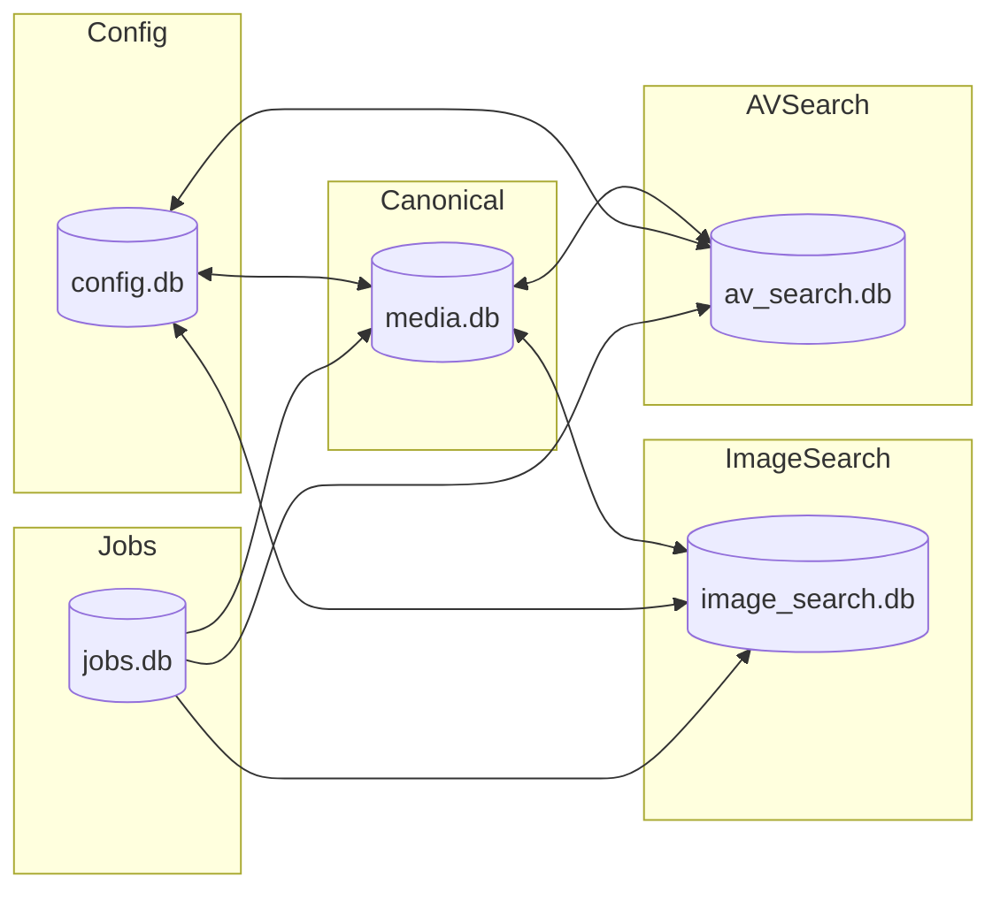

# ADR-009: Split Search Stores by Modality and Normalize Media Catalog

## Context
- Current state mixes concerns:
  - `video-rag.db` contains media metadata, segments, and some processing state.
  - `vector.db` holds embeddings and sqlite-vec tables.
- Requirements:
  - Split embeddings by modality.
  - Keep all search-related data for each modality together (avoid cross-DB joins per query).
  - Maintain a single canonical catalog of media metadata.
  - Enable future partitioning/sharding and safer migrations.

## Decision
- Adopt a multi-DB layout with clear ownership:
  - `media.db`: Canonical catalog (sources, media_items, segments, tags, thumbnails).
  - `image_search.db`: Image search store (image_embeddings, image_fts, image_meta_cache).
  - `av_search.db`: Audio+Video search store (video_segment_embeddings, audio_segment_embeddings, transcripts_fts, av_meta_cache).
  - `jobs.db`: Job orchestration (definitions, runs, steps, events).
  - `config.db`: Registry of partitions and migrations.
- Query discipline: Image search hits only `image_search.db`; A/V search hits only `av_search.db`. No cross-DB joins on hot paths; denormalize minimal render fields into `*_meta_cache`.
- Attach strategy: Open `media.db`, `ATTACH` the others by name and qualify tables where needed.

## Status
- Accepted.

## Consequences
- Pros: Clear boundaries, faster targeted queries, simpler tuning/backup, scalable partitions.
- Cons: Some duplication in `*_meta_cache`; requires background sync jobs and validation.

## Architecture

## Data Ownership
- `media.db` is source of truth for files and segments.
- `image_search.db` and `av_search.db` are derived stores populated by jobs; they contain embeddings, FTS, and `*_meta_cache` for render fields.

## Rollout Plan (Phased)
- Phase 0: Backups and change freeze on writes during migration windows.
- Phase 1: Ship DDL for new DBs and initialize empty databases.
- Phase 2: Backfill from `video-rag.db` + `vector.db` into new stores; build FTS and meta caches.
- Phase 3: Dual-write under feature flag; switch reads to new stores; validate counts and integrity.
- Phase 4: Cutover reads; remove dual-write.
- Phase 5: Cleanup old DBs; keep snapshot for rollback window.

## Checklists
- Schema
  - [ ] Finalize DDLs for `media.db`, `image_search.db`, `av_search.db`, `jobs.db`, `config.db`.
  - [ ] PRAGMAs (`WAL`, `foreign_keys`, `synchronous`), indexes.
- Backfill
  - [ ] Items/segments -> `media.db`.
  - [ ] Embeddings -> modality stores with correct dims.
  - [ ] FTS build (transcripts, captions where applicable).
  - [ ] Populate `*_meta_cache`.
- Validation
  - [ ] Counts by table; orphan checks; random spot checks.
  - [ ] Query parity tests (old vs new).
- Adapter & Code
  - [ ] DB adapter to ATTACH and route; feature flag dual-write.
  - [ ] Update search paths to use single-DB per modality.
- Ops
  - [ ] Backups; VACUUM; migrations registry in `config.db`.
  - [ ] Rollback toggles and graceful disable.

## Alternatives Considered
- Single DB for everything: simpler, but heavier contention and harder to scale/shard.
- Split only embeddings from metadata: still requires cross-DB joins on search; slower and more complex at query time.

## Open Questions
- Retention policies for job logs and caches.
- Embedding versioning and staged re-embedding.
- Multi-language/tokenizer config for FTS.
